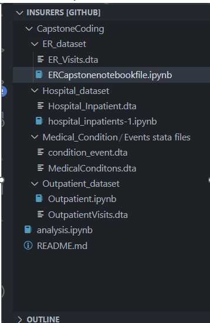
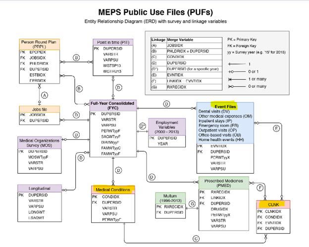
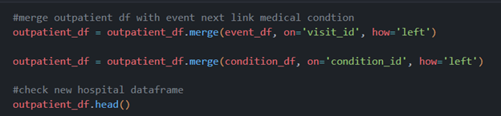
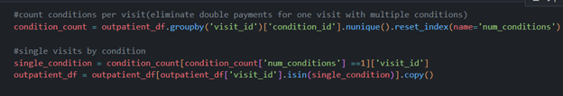
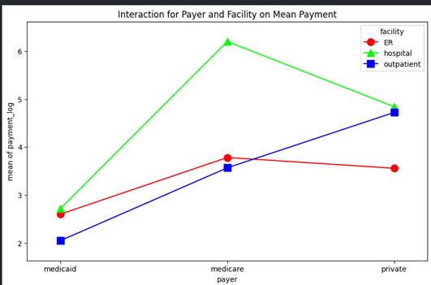
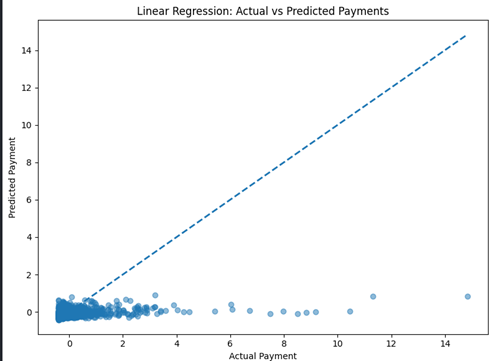
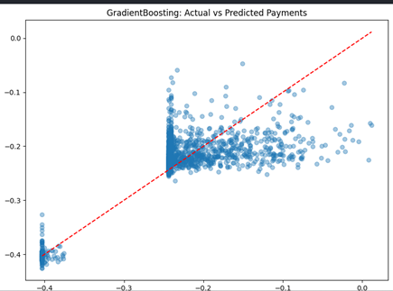
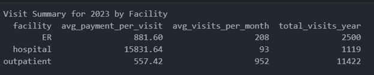

### Medicare, Medicaid, and Private Insurance Reimbursement for Outpatient clinics, ER visits, and Hospital stays in 2023
													  Insurers File 
												Western Governors University
												Data Analytics Capstone Project

This project will identify the insurance payor for 2023 that contributes the highest total amount in payments for Outpatient clinic visits, ER visits, and Hospital inpatient stays by Medicare, Medicaid, and private insurers. 

**Data extraction:**    
		Downloads from MEPS survey website [https://meps.ahrq.gov/mepsweb/data_stats/download_data_files_results.jsp?cboDataYear=2023&cboDataTypeY=204%2CHospital+Inpatient+Stays&cboDataTypeY=205%2CEmergency+Room+Visits&cboDataTypeY=206%2COutpatient+Visits&buttonYearandDataType=Search]

	Downloaded the  Stata format zip file:
		1.	HC-248F 2023 Outpatient Visits File
		2.	HC-248E 2023 Emergency Room Visits File
		3.	HC-248D 2023 Hospital Inpatient Stays File
		4.	HC-249 2023 Medical Condition File
		5.	HC-248I Appendix to MEPS 2023 Event Files

	Relational Entities
	- Outpatient, Emergency, Hospital include all payments, and a primary key of DRUPERSID, the personID.
	- The Event table is tied to the condition table and the entities tables with EVNTIDX, visit_id variable.
	- Finally the conditions table connects to event table with the visit_id and the CONDIDX, condition ID to extract the ICD10 code for the medical condition treated.

**System and program versions used:**    
	- Visual Studio Code Ide v.1.105.1
	- Jupyter extension
	- Python 3.13.5
	- Pandas 

**Pip installations:**   
	- !pip install matplotlib
	- !pip install seaborn
	- !pip install statsmodels
	- !pip install scikit-posthocs

**Imports:**      
	- import pandas as pd
	- import sys
	- import os
	- import numpy as np
	- import matplotlib.pyplot as plt
	- import seaborn as sns
	- import scikit_posthocs as sp
	- from sklearn.linear_model import LinearRegression
	- from sklearn.model_selection import train_test_split
	- from sklearn.metrics import mean_squared_error, r2_score
	- from sklearn.ensemble import RandomForestRegressor 
	- from sklearn.ensemble import GradientBoostingRegressor

**File organization:**  
**INSURERS project file**  
Files are by care facility that contain it’s own raw data, saved data file and a Jupyter notebook to analyze each datasets.  The analysis.ipynb contains the data analysis of all care facilities and payers.

 
There are folders for each care facility that include their own dataset in .csv form, and each care facility has their own jupyter, .ipynb notebook for analysis.  The final analysis with all three datasets cleaned and explored is combined in the analysis.ipynb where statistics and exploration was completed.

**Data cleaning:**
1. Renaming columns by referencing the MEPS codebook for each dataset so the column names were meaningful and clearly understood.
2. Dropping columns that were of no interest to the data questions to answer.
3. Creating aggregated  calculated columns for facility payments and doctor payments from the same Insurers as one.  All Medicare, Medicaid and Private insurance columns were made by adding the facility and doctor payments together.
4. Changing datatypes to reflect integers, month
5. Data quality check for null values returned zero after the merge of data frames.  Null values were not deleted, averaged, or substituted. 
6. Merging data sets:

 
Each care facility event file was merged with  dataset for conditions that contains  for a condition ID that was then merged with the condition dataset to reference the ICD-10 in each individual care facility folder Jupyter notebook. The dataset consisted of one visit_id, multiple ICD10 instances, and multiple payments from payors in the same month.  Each ICD10 code was being counted as paid the same amount for every  visit, double counting payments.  There can be more than one ICD10, medical condition in one visit.  In order to prevent overcounting and not having a bias dataset I used a groupby statement to analyze one visit linked to one condition. 
The merge and groupby:

  

  
 
The ER, Hospital, and Outpatient datasets for analysis concluded with columns:  

  

The analysis notebook in the Capstone coding file includes merging all three care facility dataframes for analysis.  

**Statistics performed:**  
1.	Sum of all care facility payer columns, count function for total visits, percentages for ICD10 rates for 2023.
2.	Duplicates were dropped for the same person ID and visit ID to avoid overcounting payments. with merging other datasets to ensure there would be no double counting of care facility payments to payers. Rechecking code book from MEPS website to ensure the variables were in fact the ones that were renamed for to new datasets. 

**Data Exploration:**  
Observing the size of each dataframe, column dependencies, and check for any overwhelming data.  Evaluating statistical differences in payments per care facility and/or payer. After analyzing  the datasets, the outpatient visits were ten times the amount of the ER and hospital visits. Averaging to visit per month still had outpatient visits at hundreds more than the other care facilities.  In order to find common ICD-10 conditions treated at each care facility without bias from outpatient counts, the datasets were transformed to use standardized counts.

**Statistical Tests:** 

	ANOVA, Variance Analysis type 3 to see if care facilities were dependent on payments from insurers/payers
		- Log1p used for the significant difference in payment amounts, most were smaller
		- Effects of insurance payers and care facilities on payments.

	All p values were < .05 showing significant differences in care facility payments from the Insurers or payers.

	Tukey to see the difference from the ANOVA test
		- Not effective due to log variable for extreme payment differences from payers

	Linear Regression 
		- Model created with payment normalization for extreme differences in payments
		- Diagram shows only small payments can be predicted

	Gradient Booster Regression model
		- Used quantile .75 for payment column to clean outliers for better prediction
		- R squared value for model is 64% 
		- The graph shows predicted and actual payments closer to the line and also represents low and high payments have predictions.

	Importances for the Gradient Boosting Model
		- Hospital care facility influenced payment predictions by 84%

**Results and Evaluation:**  
	A.	Identify the most impactful payer of medical expenses for 2023 among Medicare, Medicaid, and Private insurance across clinics, ER visits, and hospital inpatient stays.

		Private insurers were the largest payers of medical expenses in 2023, accounting for $13,556,555.28, or 51.57% of total payments that year.
		- Medicare was the highest payer at hospital facilities at $8,440,351.92.
		- Private insurers paid the highest for 2023 at ER facilities at $1,442,373.94
		- Private insurers were also the highest payers of outpatient facilities at $4,696,794.70

		Percentage of payments by insurers for the total year of 2023:
		- Medicare: 37.78%
		- Medicaid: 10.65
		- Private: 51.57%

	B.	Care facility with the most payments for 2023  
		Hospital total payments: $17,715,609.16
		Outpatient total payments: $6,366,823.64
		ER total payments: $2,203,996.39

		Hospital:  
		hospital Medicare: $8,440,351.92, hospital Medicaid: $1,857,870.60, hospital private: $7,417,386.64

		Outpatient:  
		outpatient Medicare: $1,072,116.65, outpatient Medicaid: $597,912.29, outpatient private: $4,696,794.70

		ER:		 
		ER Medicare: $417,915.50, ER Medicaid: $343,706.95, ER Private: $1,442,373.94

	C.	Statistical differences in payments, a two-way ANOVA will be used, with insurance payor and service type as individual variables, to 		determine if payments vary across categories or if there is an interaction effect

		sum_sq	df	F	PR(>F)
		Intercept	1.087794e+08	1.0	1.11	0.291360
		C(payer)	6.943190e+08	2.0	3.55	0.028659
		C(facility)	3.651906e+09	2.0	18.69	0.000000
		C(payer):C(facility)	2.930338e+10	4.0	74.99	0.000000
		Residual	1.106131e+12	11322.0	NaN	NaN

 
	The P values are < .05 and indicate payers and facility are predictors of payments.
	The post hoc test:
		Facility        ER      Hospital  Outpatient
		ER            1.0000       0.0        0.2342
		Hospital     0.0000       1.0        0.0000
		Outpatient  0.2342       0.0       1.0000

	Different payers behave differently depending on facility:

-	Regression analysis to evaluate payment growth or decline for 2023 and provide projections for future trends
-Linear Regression R^2 value closer to zero, the graph that shows predictions are not being done for high payments:

 
The Gradient Boosting Regression Model has r^2 result of .64. The variance in payment is about 64% according to the R^2 variable. sixty four percent of payments are explained by payers and facility in this Gradient Boosting Regressor Model.

In this visual there are now higher payments on the predicting upper side of the graph. Also, we are seeing the actual payments and the predicted payments closer to the line than on the linear regression graph.

Importances based on the Gradient Boosting Regression Model:

**Key Performance Indicators include:**
	1. Highest payment month by payor
		The top payer for any given month in 2023 was from private insurers in November, in the amount of $1,160,036.17, to hospital care facilities 
		
		By care facility:
		**Hospital** Month with Highest Payments: November
		Total: $2,212,753.94
		Top Payer: private $1,160,036.17

		**Outpatient** Month with Highest Payments: May	
		Total: $689,888.75
		Top Payer: private $548,879.62

		**ER** Month with Highest Payments: February
		Total: $308,774.78
		Top Payer: private $227,438.42  
			A.	Total payment for 2023 from payers:
				Total 2023 Payments: $26,286,429.19  

		**Private** 2023 payments: $13,556,555.28,  Percentage: 51.57 %  
		**Medicare** 2023 payments: $9,930,384.07  Percentage: 37.78 %  
		**Medicaid** 2023 payments: $2,799,489.84, Percentage: 10.65 %  

	2.	Visit details:  
		-Average payment per visit per month  
		-Average number of visits per month  
		-Average number of visits per year  

 
	3. The top treated medical condition from the listed payors    
		Top 3 ER conditions:  
		I10, count: 93       T14, count: 90     N39, count: 81

		Top 3 hospital conditions:  
		Z34, count:74    Z96, count: 50     J18, count: 45  
		
		Top 3 outpatient conditions:  
		C50,  count:677     M25, count:418     E11, count:348

		-The common ICD-10 condition visit to all care facilities is Z34, Encounter for supervision of normal pregnancy.  

		**ICD10**	**ER%**	**Hospital_%**	**Outpatient_%**	**Average_%**  
			Z34	1.88	6.70	2.23	3.60  
			M25	1.44	2.59	3.66	2.56  
			I10	3.72	2.95	0.94	2.54    

	4. Top ICD-10 payment for the year/month for each payer and care facility:    

		Top ICD-10 Condition per **Payment** **per** **Year** per Facility and Payer  

		**ER**
		Payer      ICD10   payment          %
		Medicaid   J45    18249.0          5.0  
		Medicare   I10    19840.0          5.0  
		private    I63   112594.0          8.0  

		**Hospital**
		Payer       ICD10   payment           %
		Medicaid   Z34     203073.0         11.0  
		Medicare   M53     695747.0          8.0  
		private    Z34     796696.0         11.0  

		**Outpatient**
		Payer       ICD10     payment         %
		Medicaid    K50      47159.0          8.0  
		Medicare    C50      75388.0          7.0  
		Private     C50     517124.0         11.0  

		Top ICD-10 Condition with the **Highest** **Payment** **Month** per Facility and Payer  

		**ER**
		Payer        ICD10    Month    payment  
		Medicaid       I10        6         5222.0  
		Medicare       I10        6         6480.0  
		Private        I63        2       112428.0  

		**Hospital**
		Payer         ICD10      Month      Payment
		Medicaid      J45          10         85184.0  
		Medicare      M53          11        269294.0  
		Private       M25          11        275707.0  

		**Outpatient**
		Payer        ICD10         Month        Payment
		Medicaid     N83            2               14848.0  
		Medicare     M25            2               15410.0  
		Private      I48            5              108127.0  

	5.	Highest Payment Received for any Month, Payer, or Facility:  
	Facility: hospital, Payer: private, ICD-10: M25, Month: 11, Payment: $275,707  

	6. Payment growth or decline through 2023  
	Average Monthly Payment Changes Through 2023  
  
		Facility  Medicare avg change %  Medicaid avg change %  Private avg change %   
		ER                       0.523636                       3.391818                      0.118182  
		hospital                 9.652727                      14.990909                     16.998182  
		outpatient               0.765455                       7.991818                      6.262727

													References:  
How to write a good Readme for your Data Science project on GitHub
A guide to effective documentation practices, Pragya Verma, Mar 7, 2023, [https://medium.datadriveninvestor.com/how-to-write-a-good-readme-for-your-data-science-project-on-github-ebb023d4a50e]

Pandas.read_stata, Pandas, [https://pandas.pydata.org/docs/reference/api/pandas.read_stata.html?utm_source=chatgpt.com]

Guidance on how to merge IPUMS MEPS data to MEPS-HC data from AHRQ, [https://meps.ipums.org/meps/userNotes_linking_to_MEPS.shtml?utm_source]

A Step-by-Step Guide to the Data Analysis Process,  Will Hillier, MAY 31, 2023, [https://careerfoundry.com/en/blog/data-analytics/the-data-analysis-process-step-by-step/]

Two-Way ANOVA Test, with Python, The Complete Beginner's Guide to perform Two-Way ANOVA Test (with code!), Chao De-Yu, Jan 5, 2023. [https://towardsdatascience.com/two-way-anova-test-with-python-a112e2396d78/]

How to use conditions without double counting: Mitchell, E., Ahrnsbrak, R., Soni, A., and Machlin, S. Analyzing Medical Conditions in MEPS: User Guide (Part 1 of 2). Methodology Report #36. Rockville, MD: Agency for Healthcare Research and Quality; February 2023 [https://meps.ahrq.gov/data_files/publications/mr36/mr36ug.shtml]

MEPS HC 249: 2023 Medical Conditions, Agency for Healthcare Research and Quality Center for Financing, Access, and Cost Trends, 08/2025, [https://meps.ahrq.gov/data_stats/download_data/pufs/h249/h249doc.pdf]

How to Obtain ANOVA Table with Statsmodels, 23 Jul, 2025, [https://www.geeksforgeeks.org/data-analysis/how-to-obtain-anova-table-with-statsmodels/]

Linear Regression with sklearn using categorical variables, Saturn Cloud, 12/15/2023, [https://saturncloud.io/blog/linear-regression-with-sklearn-using-categorical-variables/]

XGBoost for Regression, Geeks for Geeks, 28 Oct, 2025
[https://www.geeksforgeeks.org/machine-learning/xgboost-for-regression/]

Merge, join, concatenate and compare, Pandas, [https://pandas.pydata.org/docs/user_guide/merging.html]
